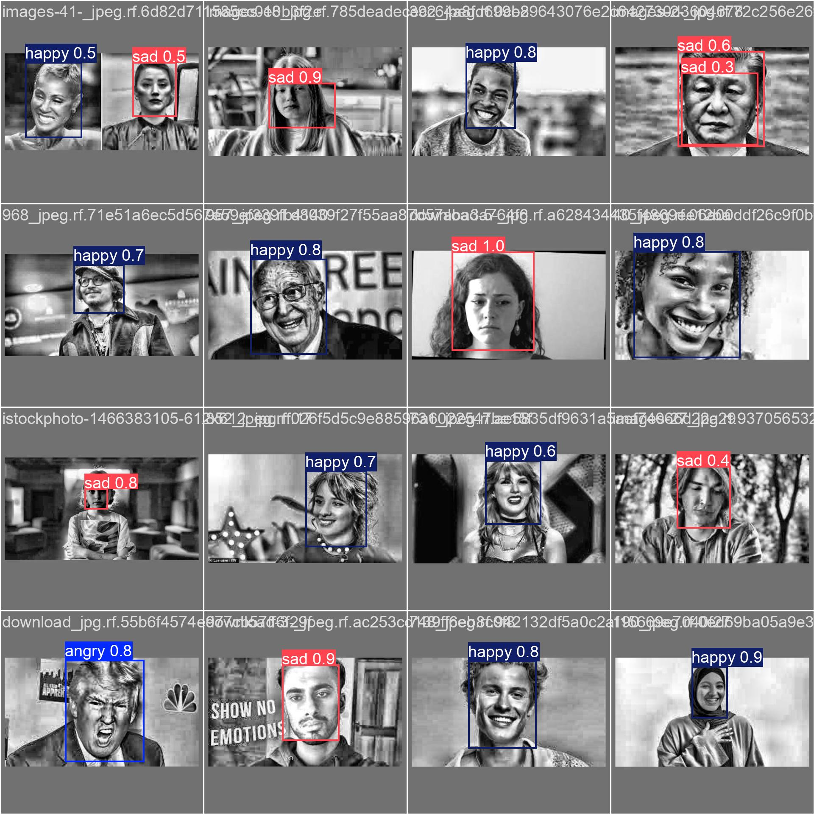

# SentientAI — Emotion Detection from Facial Expressions

<div align="center">



<br/>

[](https://python.org)
[](https://flask.palletsprojects.com)
[](https://onnxruntime.ai)
[](https://vercel.com)
[](https://github.com/rishavm003/Emotion-Detection-from-Facial-Expressions)

**Real-time facial emotion detection powered by a fine-tuned YOLO11s model —  
optimized for Vercel Serverless deployment via ONNX Runtime.**

[Features](#-features) • [Deployment](#-deployment) • [Model Performance](#-model-performance) • [Installation](#-installation) • [Usage](#-usage) • [Project Structure](#-project-structure)

</div>

---

## ✨ Features

- 🎥 **Real-time webcam detection** — live bounding boxes with emotion labels and confidence scores
- ⚡ **Lightweight ONNX Inference** — replaces heavy PyTorch dependencies (800MB → 30MB) for ultra-fast serverless execution
- 📊 **Model Results dashboard** — interactive training charts, confusion matrix, F1 curves, and validation samples
- 🌞🌙 **Light / Dark theme toggle** — premium "Cyber-Luxe" design with persistent session memory
- 📸 **Snapshot & Flip** — save the current frame with detection overlays or mirror the feed
- 🌍 **Vercel Native** — fully configured for serverless deployment with optimized cold starts

---

## 🎬 Demo

### Live Detection Tab
The main interface runs a high-performance detection loop (60 FPS render) decoupled from the inference API to ensure zero UI lag.

### Model Results Tab
A full analytics dashboard built from the original Kaggle training run, featuring per-epoch loss curves and precision/recall metrics.

---

## 📈 Model Performance

Trained using **YOLO11s** (fine-tuned on Kaggle GPU) across 9 emotion classes.

| Metric | Score | Metric | Score |
|---|---|---|---|
| **mAP@50** | **87.3%** | **Precision** | **80.3%** |
| **mAP@50-95** | **69.1%** | **Recall** | **80.5%** |

### Per-Class Accuracy (Final Results)
😴 Sleepy: **95%** | 😊 Happy: **91%** | 😠 Angry: **86%** | 😨 Fear: **84%** | 😢 Sad: **83%** | 😲 Surprised: **80%**

---

## 🛠 Installation

### 1. Clone & Setup
```bash
git clone https://github.com/rishavm003/Emotion-Detection-from-Facial-Expressions.git
cd Emotion-Detection-from-Facial-Expressions
python -m venv venv
source venv/bin/activate  # On Windows: .\venv\Scripts\activate
```

### 2. Install Dependencies
This project uses a production-optimized `requirements.txt` designed for lightweight deployment:
```bash
pip install -r requirements.txt
```

### 3. Model Weights
The model weights are stored in the `model/` directory in **ONNX** format for compatibility with the new inference engine.
- Primary Model: `model/best.onnx`
- Metadata: `model/results.csv`

---

## 🚀 Usage

### Local Development
```bash
python app.py
```
Visit `http://127.0.0.1:5000` to interact with the neural link.

### Vercel Deployment
The project is ready for one-click deployment. It includes a `vercel.json` and uses the `@vercel/python` runtime.
1. Connect your GitHub repo to Vercel.
2. The `model/best.onnx` will be bundled automatically.
3. Cold starts are minimized due to the removal of heavy libraries like `torch` and `torchvision`.

---

## 📁 Project Structure

```
Emotion-Detection-from-Facial-Expressions/
│
├── app.py                  # Flask entry point (Vercel compatible)
├── vercel.json              # Deployment configuration
├── utils/
│   └── onnx_engine.py       # Custom YOLO11 inference using ONNX Runtime
│
├── model/
│   ├── best.onnx            # Lightweight production weights
│   └── results.csv          # Training history for analytics
│
├── templates/
│   └── index.html           # SPA Frontend
│
├── static/
│   ├── style.css            # Cyber-Luxe design system
│   └── results/             # Training visual assets
│
└── evaluate.py              # Performance reporting script
```

---

## 🏗 Tech Stack

| Layer | Technology |
|---|---|
| **Core Model** | Ultralytics YOLO11s (Fine-Tuned) |
| **Inference** | ONNX Runtime (CPU Optimized) |
| **Backend** | Flask |
| **Deployment** | Vercel Serverless |
| **Frontend** | Vanilla JS / CSS · Chart.js |

---

## 📄 License

This project is licensed under the MIT License.

<div align="center">
Made with ❤️ by <a href="https://github.com/rishavm003">rishavm003</a>
</div>
